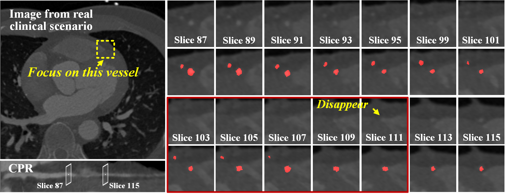
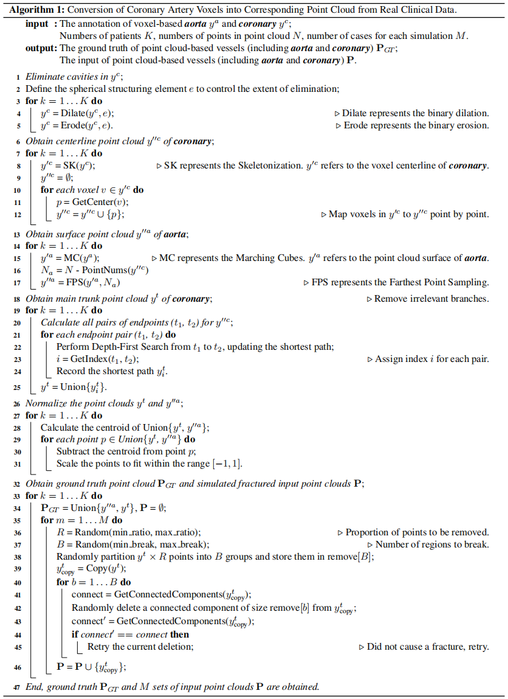

# Rethinking the Detail-Preserved Integration of Complex Tubular Structures from a Unique Point Cloud Perspective: a Dataset and a Benchmark

Complex tubular structures are essential in medical imaging and computer-assisted diagnosis, where their integrity enhances anatomical visualization and lesion detection. However, existing segmentation algorithms struggle with structural discontinuities, particularly in severe clinical cases such as coronary artery stenosis and vessel occlusions, which leads to undesired discontinuity and compromising downstream diagnostic accuracy. Therefore, it is imperative to reconnect discontinuous structures to ensure their completeness. In this study, we explore the tubular structure reconnection from a unique point cloud perspective for the first time and establish a novel Point Cloud-based Coronary Artery Completion (PC-CAC) dataset, which is derived from real clinical data. This dataset provides a novel benchmark for tubular structure reconnection. Additionally, we propose TSRNet, a novel Tubular Structure Reconnection Network that integrates a detail-preservated feature extractor, a multiple dense refinement strategy, and a global-to-local loss function to ensure accurate reconnection while maintaining structural integrity. Comprehensive experiments on our PC-CAC and two additional public datasets (PC-ImageCAS and PC-PTR) demonstrate that our method consistently outperforms state-of-the-art approaches across multiple evaluation metrics, setting a new benchmark for point cloud-based tubular structure reconstruction.

## Motivation

## Key Innovation
- 🔍 **The first point cloud-based tubular structure reconnection dataset**: To our best knowledge, we build the first point cloud-based coronary artery (PC-CAC) dataset from clinical data. This dataset will be open-sourced, offering a new perspective for tubular structure reconnection and fostering advancements in this field.
- ⚡ **A novel exploration and high-performing baseline**: Our work represents the first attempt to explore tubular structure reconnection from a point cloud perspective. We propose a baseline designed for accurately reconnecting fractured tubular structures, comprising a detail-preserved feature extractor, a multiple dense refinement strategy, and a global-to-local loss function. These methods cooperate to enhance detail preservation and effectively handle hard-to-represent regions.
- 🚀 **A sufficient evaluation with experiments**: To objectively evaluate our approach, experiments are conducted on our PC-CAC dataset and two public datasets. Experimental results show that our method achieves state-of-the-art performance across multiple datasets.🔑
  

## How to perform the voxel-to-point cloud conversion process.

## 📊 Dataset Overview

### a) The details of two publicly available datasets in our task

| Name        | Target Dataset | Train/Val/Test     | Detail Information                                                                                                                                     | Pre-processing                                                                                             |
|-------------|----------------|--------------------|--------------------------------------------------------------------------------------------------------------------------------------------------------|-------------------------------------------------------------------------------------------------------------|
| PC-ImageCAS | ImageCAS [[1]](#ref1)  | 700/100/200 5600/800/1600 | 1. Scanner: Siemens 128-slice dual-source    2. Planar resolution: 0.29 ~ 0.43 mm²    3. Slice thickness: 0.25 ~ 0.5 mm    4. x/y-size: 512 voxels, z-size: ~206 ~ 275 voxels | 1. Resample the resolution to 1 mm³    2. Normalize via `max(min(0,x),2048)/2048`   3. Obtain segmentation results   4. Extract **aorta** and main **coronary** branches   5. Generate point cloud based on surface of **aorta**   6. Generate point cloud based on centerline of **coronary** |
| PC-PTR      | PTR [[2]](#ref2)      | 599/80/160 4472/640/1280  | 1. Scan from multiple medical centers    2. Resolution: already processed to 1 mm³    3. x/y-size: 512 voxels, z-size: 177 ~ 798 voxels           | Generate point cloud based on centerline of vessels                                                        |

---

### b) The details of our proposed dataset from real clinical data

| Name   | Target Dataset | Train/Val/Test     | Detail Information                                                                                                         | Pre-processing                                                                                             |
|--------|----------------|--------------------|----------------------------------------------------------------------------------------------------------------------------|-------------------------------------------------------------------------------------------------------------|
| PC-CAC | PC-CAC         | 300/40/87 2400/320/696 | 1. Scanner: SOMATOM Definition Flash   2. x/y-resolution: 0.25 ~ 0.57 mm/voxel    3. Slice thickness: 0.75 ~ 3 mm/voxel    4. x/y-size: 512 voxels, z-size: 128 ~ 994 voxels | 1. Resample the resolution to 1 mm³    2. Normalize via `max(min(0,x),2048)/2048`   3. Obtain segmentation results   4. Extract **aorta** and main **coronary** branches   5. Generate point cloud based on surface of **aorta**   6. Generate point cloud based on centerline of **coronary** |

---

### 📌 Notes
> To ensure a diverse and challenging reconstruction task, each patient generates 8 distinct input cases, capturing a wide range of conditions.

<a name="ref1">[1]</a> ImageCAS: [https://github.com/XiaoweiXu/ImageCAS-A-Large-Scale-Dataset-and-Benchmark-for-Coronary-Artery-Segmentation-based-on-CT](https://github.com/XiaoweiXu/ImageCAS-A-Large-Scale-Dataset-and-Benchmark-for-Coronary-Artery-Segmentation-based-on-CT)  
<a name="ref2">[2]</a> PTR: [https://github.com/M3DV/pulmonary-tree-repairing](https://github.com/M3DV/pulmonary-tree-repairing)

